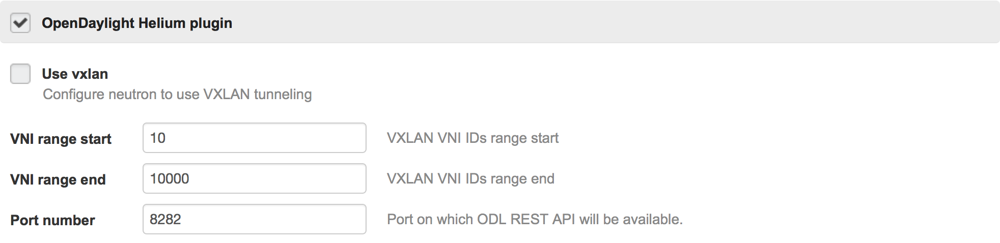
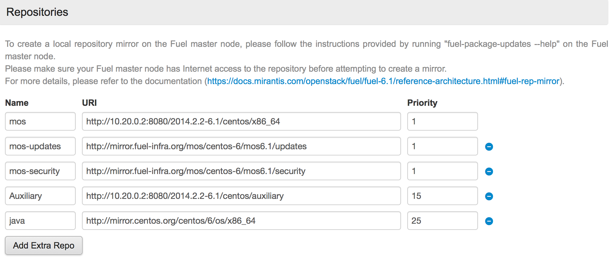

OpenDaylight Plugin for Fuel
================================

OpenDaylight plugin
-----------------------

Overview
--------

This is a proof of concept of the plugin which will install OpenDaylight controller and set it as manager for OVS using ovsdb plugin.

* [OpenDaylight controller](https://wiki.opendaylight.org/view/OpenDaylight_Controller:Main) is a SDN controller.
* [OVSDB plugin](https://wiki.opendaylight.org/view/OVSDB_Integration:Main) implement the Open vSwitch Database management protocol.

Requirements
------------

| Requirement                      | Version/Comment |
|----------------------------------|-----------------|
| Mirantis OpenStack compatibility | 6.1             |

Recommendations
---------------

None.

Limitations
-----------

* Supports only environments with Neutron
* HA for ovsdb feature is not implemented in Lithium release - one instance of ODL controller runs on primary OpenStack controller.
* L3 traffic managed by neutron agent - lack of drivers in OpenStack Juno.

Installation Guide
==================

OpenDaylight plugin installation
----------------------------------------

1. Clone the fuel-plugin-opendaylight repo from stackforge:

        git clone https://github.com/stackforge/fuel-plugin-opendaylight

2. Install the Fuel Plugin Builder:

        pip install fuel-plugin-builder

3. Install the [fpm gem](https://github.com/jordansissel/fpm):

        gem install fpm
    
4. Build OpenDaylight Fuel plugin:

        fpb --build fuel-plugin-opendaylight/

5. The *opendaylight-[x.x.x].rpm* plugin package will be created in the plugin folder.
  
6. Move this file to the Fuel Master node with secure copy (scp):

        scp opendaylight-[x.x.x].rpm root@<the_Fuel_Master_node_IP address>:/tmp

7. While logged in Fuel Master install the OpenDaylight plugin:

        fuel plugins --install opendaylight-[x.x.x].rpm

8. Check if the plugin was installed successfully:

        fuel plugins

        id | name         | version | package_version
        ---|--------------|---------|----------------
        1  | opendaylight | 0.5.2   | 2.0.0

9. Plugin is ready to use and can be enabled on the Settings tab of the Fuel web UI.

User Guide
==========

OpenDaylight plugin configuration
---------------------------------------------

1. Create a new environment with the Fuel UI wizard.
2. Click on the Settings tab of the Fuel web UI.
3. Scroll down the page, select the "OpenDaylight plugin" checkbox.
   Rest of configuration is optional

OpenDaylight controller require Java Runtime Environment. In case of CentOS system it is required to point
repository where java rpm package can be found. It can be done in Settings tab in Repositories section.
It is important to assign highest priority to mos repositories (lower number is a higher priority).

Testing
-------

Use the same IP address as for OpenStack Horizon panel and port 8181 to reach dlux web ui and apidoc explorer:

* DLUX: http://horizon_ip:8181/index.html
* APIDOC: http://horizon_ip:8181/apidoc/explorer/index.html

OpenDaylight files are stored on primary controller inside */opt/opendaylight* directory.

To log in to OpenDayligt shell run */opt/opendaylight/bin/client*

Known issues
------------

None.

Release Notes
-------------

**0.5.2**

* Initial release of the plugin. This is a beta version.

**0.6.0**

* Integrate Lithium release with OpenStack Juno.

Development
===========

The *OpenStack Development Mailing List* is the preferred way to communicate,
emails should be sent to `openstack-dev@lists.openstack.org` with the subject
prefixed by `[fuel][plugins][lma]`.

Reporting Bugs
--------------

Bugs should be filled on the [Launchpad fuel-plugins project](
https://bugs.launchpad.net/fuel-plugins) (not GitHub) with the tag `lma`.

Contributing
------------

If you would like to contribute to the development of this Fuel plugin you must
follow the [OpenStack development workflow](
http://docs.openstack.org/infra/manual/developers.html#development-workflow).

Patch reviews take place on the [OpenStack gerrit](
https://review.openstack.org/#/q/status:open+project:stackforge/fuel-plugin-opendaylight,n,z)
system.

Contributors
------------

* Michal Skalski <mskalski@mirantis.com>
